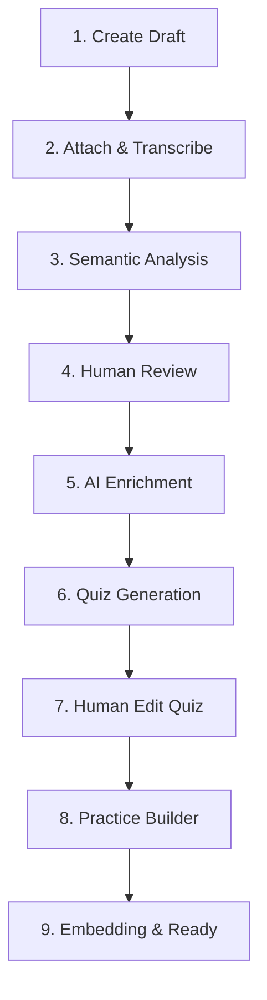

# Curriculum System (Adaptive Learning)

O Sistema de Currículo da FluencyLab é uma engine orquestrada por IA que transforma mídia bruta (vídeo/áudio) ou texto em lições pedagógicas estruturadas em 9 passos. Toda a arquitetura segue o padrão **Thin Client, Fat Server**.

## 🧭 O Ciclo de Vida de 9 Passos

### Detalhamento dos Passos

| Passo | Ação / Objetivo | Endpoint (Safe Action) | Observação Técnica |
| :--- | :--- | :--- | :--- |
| **1** | Criação inicial (Título, Nível CEFR, Idioma) | `createLessonAction` | Define o container da lição. |
| **2** | Upload & Transcrição (Upload Direto) | `getSignedMediaUploadUrlAction` + `attachMediaAction` | 🚀 **Signed URLs (V4)**: O cliente sobe a mídia direto no storage antes de processar. |
| **3** | Extração de Vocabulário e Estruturas Gramaticais | `analyzeLessonAction` | NLP Parser via Gemini. |
| **4** | Revisão manual dos itens sugeridos | (Interface Admin) | Humano revisa lemmas e contextos. |
| **5** | Enriquecimento (Imagens, Fonética, Sinônimos) | `enrichItemsAction` | ⚡ **Batch Processing**: Envia múltiplos itens de uma vez para reduzir custo e tempo. |
| **6** | Geração de Quiz (Contexto, Listening, Gramática) | `generateQuizAction` | IA gera JSON de quiz multimodal. |
| **7** | Edição manual do Quiz (Refinamento humano) | `updateQuizAction` | Interface para alteração de perguntas/respostas. |
| **8** | Construção de Práticas (Flashcards, GapFill) | `finalizeLessonAction` | Gera o array de práticas determinísticas. |
| **9** | Geração de Vetores (Embeddings) e ativação | `finalizeLessonAction` | 🔒 **Content Hash**: Só vetoriza se o texto da lição mudou (SHA-256). |

---

## 🧠 Regras Pedagógicas e de Interface

### Tradução em Camadas (Tiered Translation)
O sistema adapta os campos baseado no nível:
- **A1/A2**: Campo `translation` é obrigatório nos metadados.
- **B1**: Tradução apenas do Lemma.
- **B2+**: Imersão total. O campo `synonyms` torna-se protagonista na UI, e `translation` deve ser ocultado.

### Transcrição Inteligente
O Step 2 gera timestamps milimétricos. A UI deve usar esses dados para sincronizar o vídeo com o exercício e permitir que o aluno clique em uma palavra para ver sua tradução/significado no tempo exato.

---

## 🛠️ Server Actions Registry (Specs para UI)

### `getSignedMediaUploadUrlAction`
- **Uso**: Chamado no início do Step 2.
- **Input**: `{ fileName, contentType }`
- **Output**: `{ url, path }`. A `url` é o destino do PUT request (Browser-to-Storage).

### `enrichItemsAction` (Otimizado)
- **Modo**: Batch.
- **Payload**: Recebe um array de itens. A lógica interna faz o split e join para a IA, retornando sucesso imediato após processamento em massa.

### `cloneLessonAction` (Versionamento Seguro)
- **Uso**: Quando um administrador quer editar uma lição que já está "ready" e em uso.
- **Impacto**: Cria uma cópia inteira (v2), clona as relações, e aplica Soft-Delete (`deleted_at`) na v1 para que ela não seja distribuída a novos alunos.

### `/api/curriculum/stream` (SSE Server-Sent Events)
- **Uso**: Endpoint HTTP (GET) não-RPC para feedback em tempo real no Admin Dashboard.
- **Suporte**: `?step=2` (Transcrição) e `?step=3` (Análise Semântica). Retorna chunks de texto via `ReadableStream` para a UI.

### `deleteLessonAction` (Resiliência)
- **Tipo**: Soft-Delete.
- **Impacto**: O registro permanece no DB mas com `deleted_at` preenchido. A UI de admin deve lidar com estados de "Lixeira" se necessário.

---

## 🗄️ Esquema de Dados Evoluído

- **`curriculum_lessons`**: Contém `contentHash`, `version` e `deleted_at`.
- **`curriculum_learning_items`**: Agora suporta `synonyms` (array) e `translation` (string opcional).
- **`rate_limits`**: Tabela de controle para evitar abusos nas APIs de IA e Webhooks.

---

## 🚑 Tratamento de Erros e Verificação
- **Build & Lint**: O sistema foi validado com `npm run build` e `lint`, garantindo que todas as Server Actions possuem tipos estritos para o React Hook Form.
- **Revalidação**: Todas as ações utilizam `revalidatePath`, garantindo que a UI se atualize sem refresh manual após cada passo do pipeline.
